---
date:
  created: 2024-11-22
  updated: 2024-11-24

#search:
  #exclude: true

slug: "/post1"
title: "Интерфейс для системы контроля доступа и видеонаблюдения"
metaTitle: "Интерфейс для системы контроля доступа и видеонаблюдения"
sort: "1"

---

## Год 

2021

## Что сделано

Разработан новый интерфейс системы для управления доступом на предприятие. 

## Контекст

Я работала продуктовым дизайнером в компании, которая разрабатывала собственные цифровые решения и занималась их внедрением. Один из продуктов компании -  система видеонаблюдения.

В компанию обратился клиент с задачей автоматизировать пропускной режим на своем предприятии. 

Какие цели стояли: бесконтактный проход сотрудников через турникеты, бесконтактное измерение температуры, контроль рабочего времени, организация временных пропусков.

Глобально требовалось интегрировать систему видеонаблюдения, разработанную в компании, с существующей у клиента системой Sigur, настроить аутентификацию через Active Directory и доработать функциональность с формированием отчетов.  

Старый интерфейс системы видеонаблюдения не предусматривал масштабируемость. И было принято решение полностью переработать интерфейс продукта.  

## Формат

Веб-сервис без верстки для мобильных устройств

## Команда

- Дизайнер - это я 👋
- Проджект-менеджер,
- Аналитик,
- Лицо принимающее решение (ЛПР).
- Тим-лид команды разработки.

## Процесс

На предварительных обсуждениях проджект-менеджер рассказал о продукте, его пользователях, конкурентах, поделились ссылками на артефакты существующей версии и требованиями к новой функциональности.

Мы договорились разбить работы над интерфейсом на этапы:

1.  Интерфейсы для разделов “Устройства” и “Пользователи”,
2.  Интерфейсы для разделов “Отчеты” и “Администрирование”,
3.  Интерфейсы для раздела “Мониторинг”.

### Подготовка

И вот я приступила к работе над интерфейсами первого этапа.

1. Я начала с изучения существующей версии продукта. Установила продукт и попробовала самостоятельно выполнить первые настройки, руководствуясь документацией пользователя.
    
    Вот так выглядел интерфейс приложения, которое требовалось доработать:

    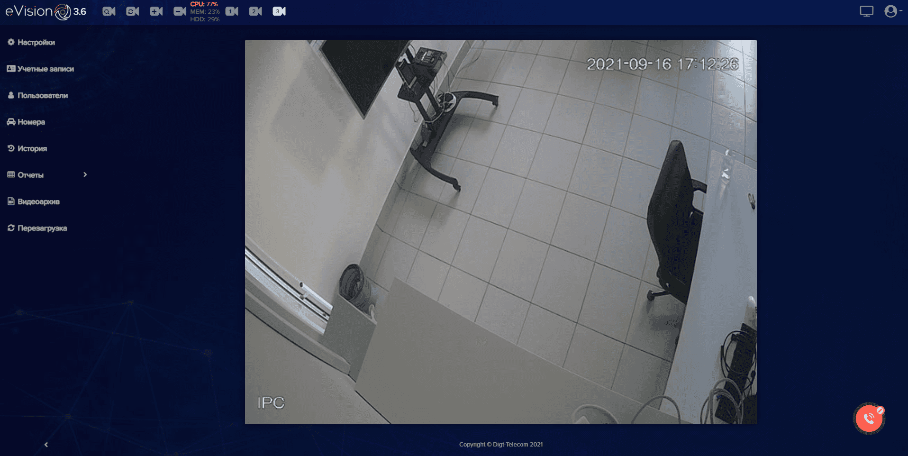

2. Изучила требования к новой функциональности. Выделила сценарии использования в разбивке по ролям. Составила карту функций, чтобы осознать связь между функциональными блоками. 

    - [Ссылка на карту функций](https://www.figma.com/board/tiIJ3Hv3RNT8f5jrfHiKxY/01-case-%D0%BA%D0%B0%D1%80%D1%82%D0%B0-%D1%84%D1%83%D0%BD%D0%BA%D1%86%D0%B8%D0%B9?node-id=0-1&t=7acwlSt9UjbS1mxU-1)

    - [Ссылка на реестр сценариев](https://docs.google.com/spreadsheets/d/13eY5h-dG_va8fw0-JYh8TS8mpH_UEvt4yg3OH-H-CdU/edit?usp=sharing)

    Стоит отдельно упомянуть, что моей задачей было спроектировать интерфейс с максимальной функциональностью (для роли Администратор).

    
    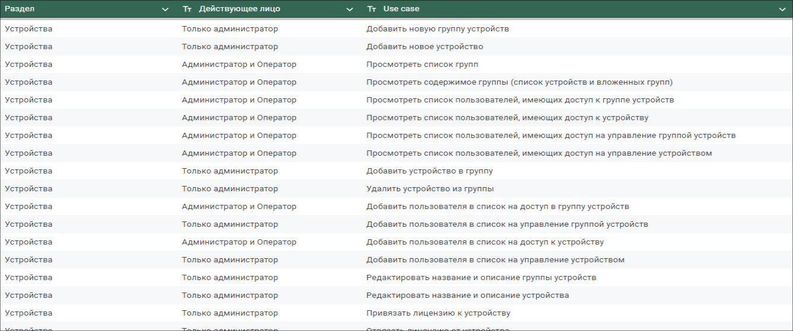        
  
3. Изучила конкурентов. Моей целью было изучить каким образом в системах конкурентов реализуются пользовательские сценарии моего продукта. Некоторые системы удалось установить на компьютер и получить собственный пользовательский опыт. С другими же я познакомилась только по документации. Мне не удалось получить к ним пробный доступ.

Аналитикой пользователей на этом проекте я не занималась. Проджект-менеджер достаточно хорошо исследовал своих клиентов. И все, что было необходимо, мне рассказывал менеджер.

### Концептуальный макет

После этапа с подготовкой я приступила к проектированию концептуального макета.

1. **Навигация**. 
   
    В моем представлении навигация системы должна была состоять из двух уровней.
 
    - **Первый уровень** - выбор раздела. 
     
        Предполагались 4 раздела - Устройства, Пользователи, Администрирование и Мониторинг. 
      
        Устройства и Пользователи объединяются в группы. Группы могут быть вложенными. А значит нам нужен удобный второй уровень навигации, в котором пользователь сможет выбрать группу. 

        На предварительных обсуждениях ЛПР ссылался на систему конкурента, в которой навигация первого уровня вынесена в верхнюю панель. При проектировании я учла этот факт. И подготовила первый вариант с навигацией, размещенной в верхней панели, а также в качестве альтернативы - второй вариант с навигацией в левой панели.

        
 

    - **Второй уровень** - выбор группы. 

        По функциональным требованиям в системе могут отображаться группы, которые были созданы локально, и группы, полученные из внешних систем. 
        
        У меня было несколько идей по проектированию групп, но поскольку не было возможности и времени проводить исследования, мы с проджект-менеджером решили заимствовать опыт конкурентов. Навигацию второго уровня мы разместили в левой панели. Локальные и внешние группы разбили на два отдельных иерархических дерева. 
        
        Далее мы рассматривали несколько вариантов размещения глобального поиска и кнопки для добавления новых сущностей. 
        
        Я подготовила 2 варианта: 

          - вынести поиск на верхнюю панель, а кнопку "Добавить" разместить в боковой панели на панели,
          - оставить поиск и кнопку "Добавить" в левой панели. 

        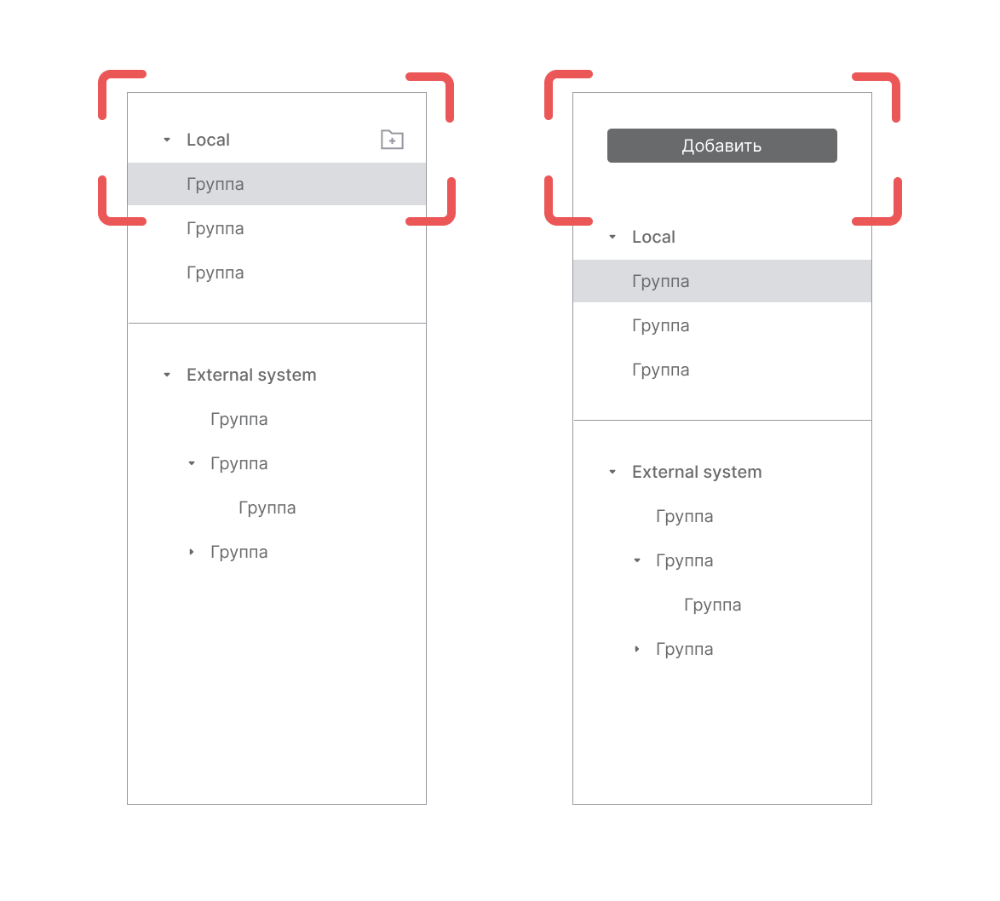        

        Для того, чтобы пользователь понимал, где находится, мы добавили компонент с хлебными крошками перед табличной частью.

        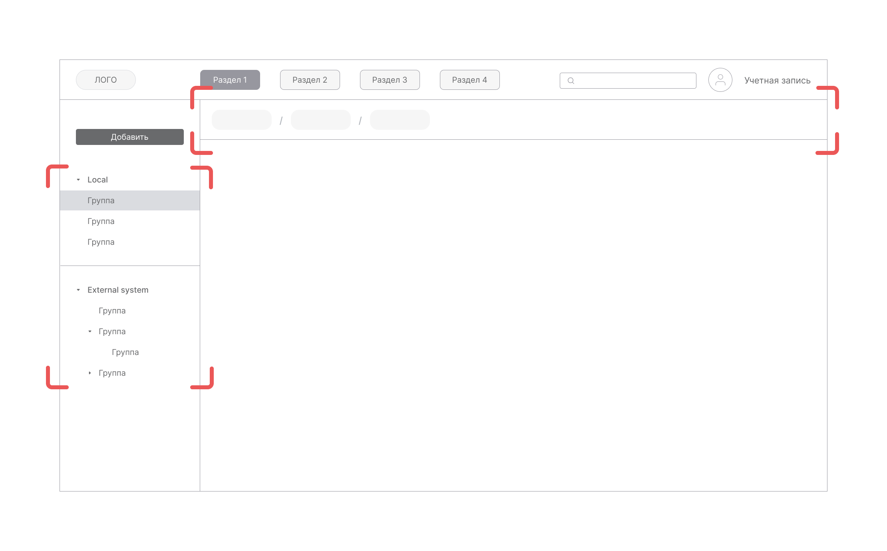

2. **Таблицы**. 
   
    Устройства и пользователи, сохраненные в группах, должны быть выведены в интерфейс в виде таблиц. 
    
    На этапе концептуального макета я не углублялась в проработку представления данных. Эта работа перенесена на следующий этап. 
    
    На данном этапе моей задачей было определить основные требования к таблицам. По всем вопросам я контектировала с проджект-менеджером. 
    
    - **Размещение**. На экране должна отображаться одна таблица, которая занимает 100% доступной ширины экрана. 
    
    - **Фильтрация**. Я рассматривала 3 варианта размещения фильтрации:
 
        1. в шапке таблицы (по аналогии с таблицами Excel), 
        2. вызывать панель с фильтрами по кнопке (по аналогии компонентом [“Table”](https://mui.com/material-ui/react-table/) из библиотеки Material UI v6),  
        3. на отдельной панели над шапкой таблицы.
        
        В результате мы остановились на последнем варианте.

    - **Поиск**. По требованиям поиск должен работать по одному атрибуту - “Название”. Поэтому для поиска я выбрала стандартный компонент в виде инпута.

    - **Пагинация или бесконечная прокрутка?** К решению этого вопросам был привлечен тимлид команды разработки. В результате мы остановились на “бесконечной прокрутке”.
        
           
   
3. **Форма просмотра объекта**.
    
    Для просмотра профиля устройства или пользователя нужно было предусмотреть отдельный интерфейс.
    
    Я рассматривала несколько вариантов - модальное окно  или переход на новую страницу. Поскольку в профиле предусматривались различные сценарии взаимодействия, которые потребуют вызова других интерфейсов, я остановилась на варианте с переходом на новую страницу. 

4. **Форма создания объекта**. 
    
    По требованиям система должна предоставить возможность подключить новое устройство, создать нового пользователя и новую группу. Поля формы можно было разбить на несколько логических блоков. Это позволило представить форму в виде пошагового мастера. По аналогии с формой просмотра я решила выводить этот мастер с переходом на новую страницу. 

### Первая итерация согласований

Далее я вышла на согласование концептуального макета с командой. 

Не буду останавливаться на описании этого этапа. С ним не возникло сложностей. Все мои предложения были приняты ЛПР. Что касается навигации, решено было остановиться на первом варианте с размещением навигации в верхней панели, а поиск и кнопку "Добавить" оставить в левой панели.

_**Дисклеймер.** Я не упоминаю про контекстное меню и действия с группами в боковой панели. Я рассматривала эту функциональность, но для первой версии системы было решено от нее отказаться._

### UI-kit

В качестве визуального ориентира ЛПР обозначил посадку старой версии продукта. На этом этапе я собрала локальный UI-kit для светлой темы. 

Стоит отметить, что у меня не было задачи прорабатывать полноценную дизайн-систему. 

### Проработка таблиц

На этом этапе я прорабатывала представление данных в таблицах и действия с ними. 

1. **Систематизация данных**. 
    
    Я систематизировала данные объектов, которые должна содержать таблица, и действия, которые пользователь может совершить. Далее вместе с проджект-менеджером мы проговорили структуру таблицы.
    
    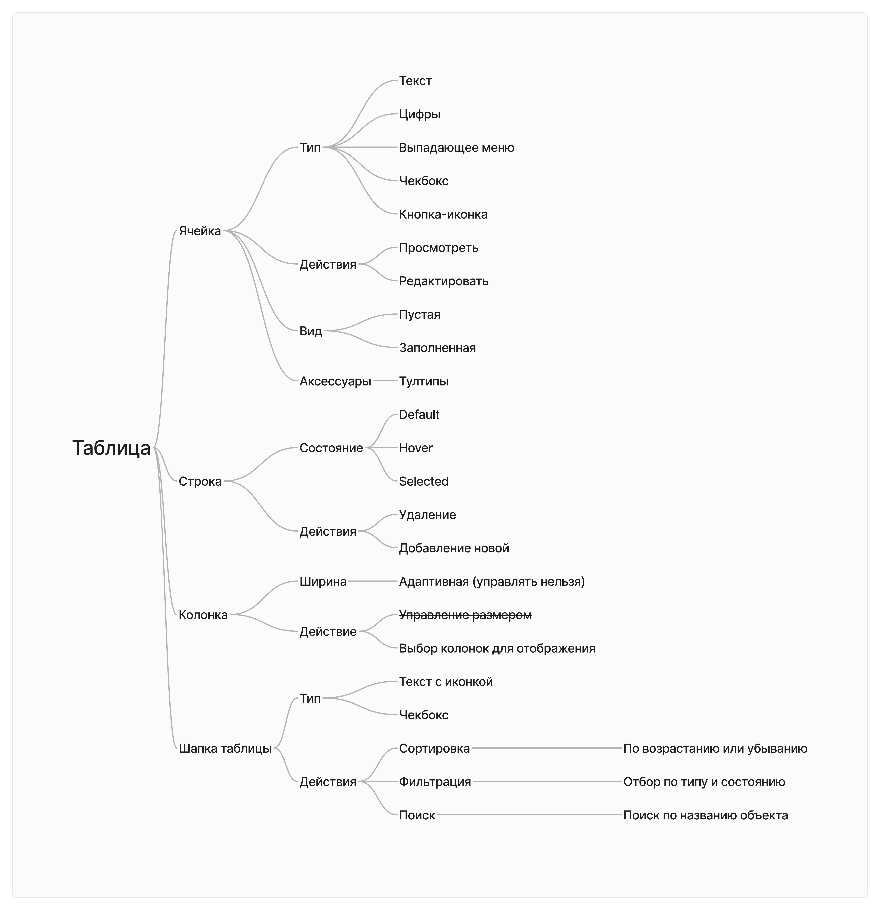

2. **Адаптивность**. 
    
    Напомню, что в данном проекте не предусматривалась верстка для мобильных устройств. На этапе с концептуальным макетом я выяснила, что таблица должна занимать 100% доступной ширины. Мы отказались от фиксированной ширины ячеек. Ячейки должны равномерно распределяться на экране. Текст в них должен отображаться без обрезания (если возможно) и переноса. 

3. **Ячейки**. 
    
    На этом шаге я прорабатывала внешний вид ячеек и подготавливала для них компоненты в макете. 

4. **Строки**. 
    
    На этом шаге я собрала компоненты для строк и проверяла гипотезу с “зеброй”. В некоторых гайдах по проектированию таблиц рекомендуют использовать чередующуюся заливку строк в виде “зебры”, чтобы сделать информацию лучше читаемой. Мы проговорили эту гипотезу с проджектом и в конечном итоге отбросили. В нашем случае “зебра” скорее отвлекала от чтения таблицы. 

    

    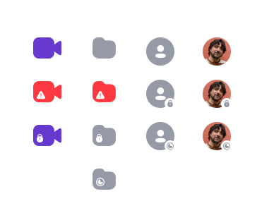
    
    

    

5. **Столбцы**. 
   
    Было решено отказаться от регулятора ширины столбцов. Для упрощения просмотра мы добавили настройку отображения столбцов.

     

6. **Действия с элементами списка**.
    
    - Одиночные действия вынесли в виде привычной кнопки-иконки “Три точки”, при клике на которую открывается выпадающее меню с действиями.

        

    - Групповые действия. Я выяснила, что пользователи редко обращаются к сценариям с групповыми действиями. Кроме того, групповые действия доступны не всем ролям в системе. Поэтому я предложила вызывать кнопки действий при проставлении отметки чекбоксом.  А для ролей, для которых эти действия недоступны, чекбоксы скрыть из интерфейса.

        

### Проработка форм для создания объектов

Еще на этапе с концептуальным макетом мы определились, что форма будет разбита на глобальные логические шаги.  

- **Форма "Добавление устройства":**

    Шаг 1: Параметры подключения,
    
    Шаг 2: Настройки устройства,

    Шаг 3: Настройки доступа.

    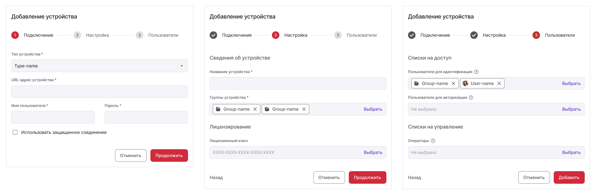

    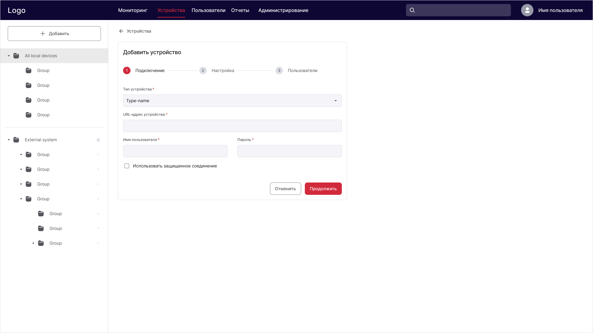

- **Форма "Создание группы устройств":**

    Шаг 1: Сведения о группе,
    
    Шаг 2: Настройки доступа.
    
    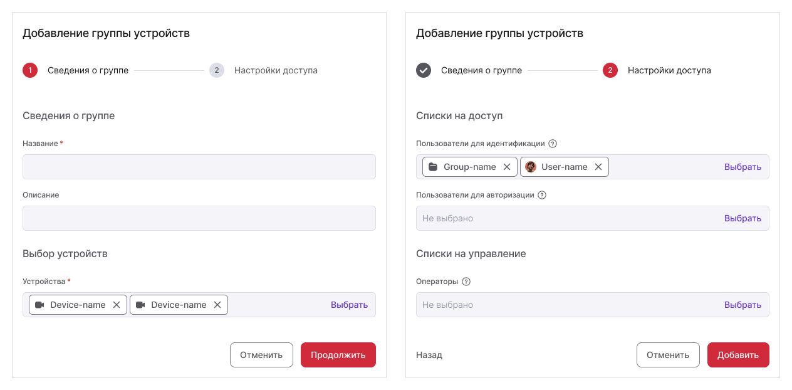

- **Форма "Создание пользователя":**

    Шаг 1: Сведения о пользователе,
    
    Шаг 2: Настройки доступа.

    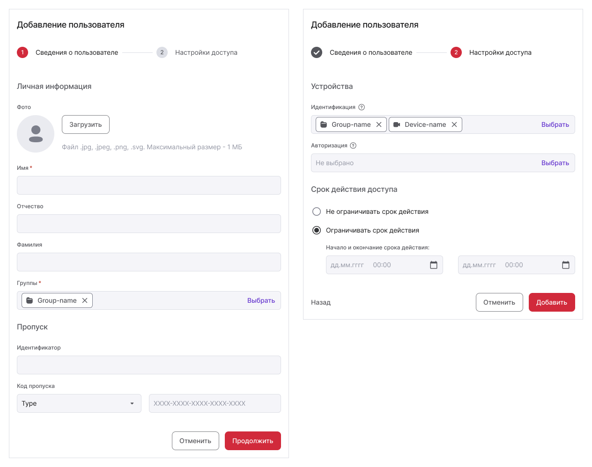

- **Форма "Создание группы пользователей":**

    Шаг 1: Сведения о группе,
    
    Шаг 2: Список пользователей.

В каждой форме я предусмотрела вызов вложенных форм в виде модальных окон. Внешний вид модальных я привела к одному шаблону.

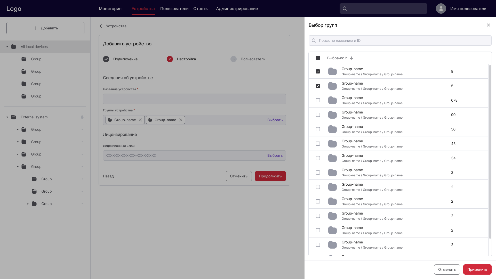

### Проработка форм для просмотра объектов

Формы просмотра требуются для просмотра профиля устройства и пользователя.

По требованиям в форме просмотра устройства пользователь должен иметь возможность просмотреть назначенные списки пользователей. И наоборот в форме просмотра пользователя пользователь должен иметь возможность просмотреть назначенные списки устройств.

Я разбила форму на 2 вкладки:

1. Вкладка со сведениями объекта.

    - Для устройств:
    
        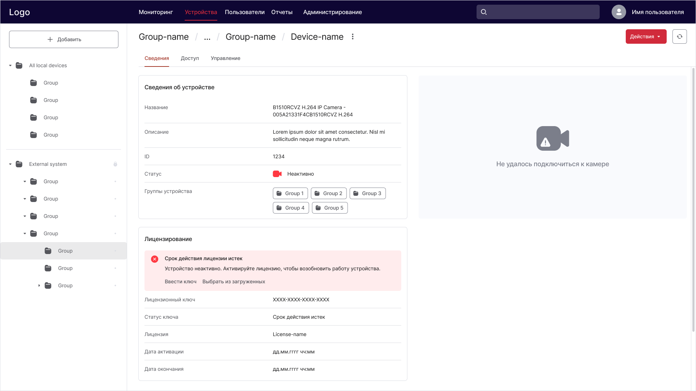

    - Для пользователей:
  
        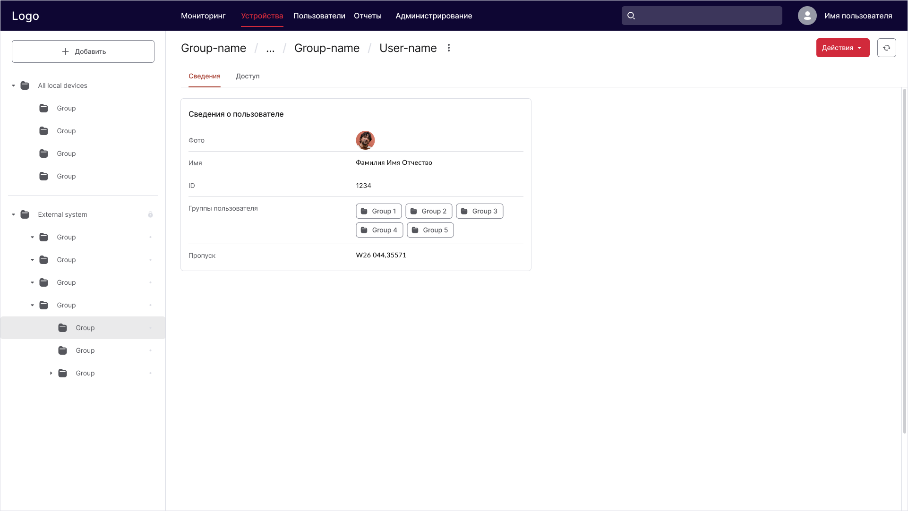

2. Вкладка с назначенными списками:

    - Для устройств - это списки пользователей, которые имеют доступ к устройству,
    - Для пользователей - это списки устройств, к которым пользователь имеет доступ.

        Для вывода списков я использовала таблицы, которые были спроектированы ранее. 

        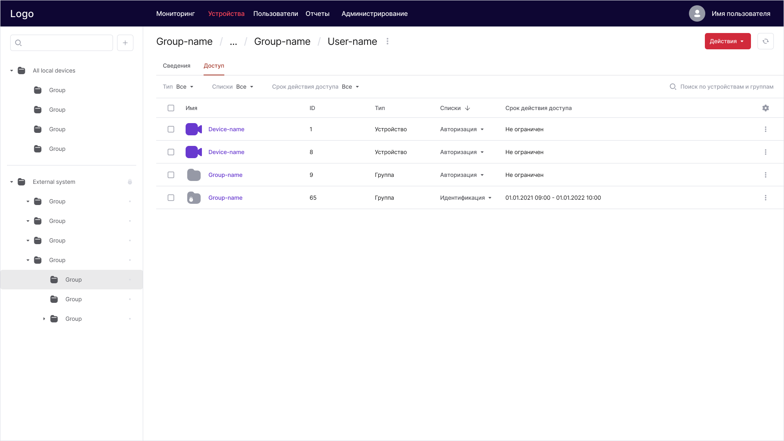 

### Вторая итерация согласований
К этому этапу я подготовила основные экраны приложения и запрототипировала основные пользовательские сценарии. 

Я провела демонстрацию команде и получила обратную связь от ЛПР. Требовалось доработать error-состояния, интерфейсные тексты и пустые состояния.   

В конечном итоге ЛПР принял работу и первая часть интерфейса отправилась в реализацию.

А дальше мне предстояла работа с разделами “Отчеты”, “Администрирование” и “Мониторинг”.

## Назад из будущего

На начало 2022 года система успешно прошла все тесты и была внедрена на предприятии клиента. К системе были подключены терминалы доступа с поддержкой технологии распознавания лиц и обнаружением людей с повышенной температурой тела. 

